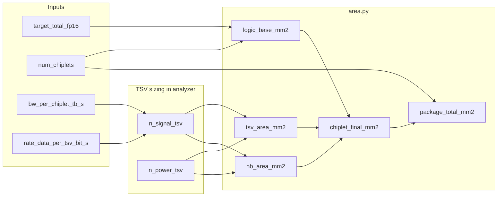

# Area Modeling

This document describes how **die and package footprint area** is estimated in **chiplet_thermal_analysis**: logic sizing from compute targets, TSV and hybrid-bond (HB) overhead, package scaling, and how area feeds power and thermal models.

Related code: `chiplet_thermal/area.py`, `chiplet_thermal/analyzer.py` (TSV pre-sizing), `chiplet_thermal/constants.py`, `chiplet_thermal/models.py` (`ChipletConfig`), `power_estimate.md` (design rationale).

---

## 1. Purpose and scope

The area model answers:

1. How large is the **logic region** (mm²) per chiplet for a given FP16 TFLOPS target?
2. How much extra area is required for **TSV** and **hybrid-bond pads**?
3. What is the **total package footprint** after chiplet count and package margin?

Areas are **planar projections** (mm²), not 3D volume. DRAM stack height enters the **thermal** model, not the area sum (memory area is not broken out separately in results).

Implementation entry point: `compute_chiplet_area_breakdown(config)` in `area.py`, called from `ThermalPowerAnalyzer.analyze()` after dynamic TSV counts are updated.

---

## 2. End-to-end flow

**Order in `analyze()`:**

1. Compute required signal/power TSV counts from bandwidth (overwrites `config.n_signal_tsv`, `config.n_power_tsv`).
2. Call `compute_chiplet_area_breakdown`.
3. Use `logic_base_mm2` for power; use `chiplet_final_mm2` for thermal footprint.

---

## 3. Per-chiplet compute target

Total system FP16 performance is split evenly across chiplets:

\[
P_{\mathrm{single}} = \frac{P_{\mathrm{total,FP16}}}{N_{\mathrm{chiplets}}}
\]

| Symbol | Config field | Example default |
|--------|--------------|-----------------|
| \(P_{\mathrm{total,FP16}}\) | `target_total_fp16` | 1979 TFLOPS (H200 reference) |
| \(N\) | `num_chiplets` | user-defined |

Units: TFLOPS per chiplet.

---

## 4. Logic area

Logic die area is derived from a **transistor-based scaling** model (not from power density):

\[
A_{\mathrm{logic}} = \frac{P_{\mathrm{single}}}{\rho_{\mathrm{tr}} \cdot U \cdot \varepsilon_{\mathrm{arch}}}
\]

| Symbol | Config field | Default | Meaning |
|--------|--------------|---------|---------|
| \(\rho_{\mathrm{tr}}\) | `transistor_density` | 150 M/mm² | Millions of transistors per mm² |
| \(U\) | `util_factor` | 0.4 | Fraction of transistors effectively used |
| \(\varepsilon_{\mathrm{arch}}\) | `arch_efficiency` | 0.0158 TFLOPS/M | Achieved TFLOPS per million transistors |

**Example:** \(P_{\mathrm{single}} = 1979/4 \approx 495\) TFLOPS, defaults above:

\[
A_{\mathrm{logic}} \approx \frac{495}{150 \times 0.4 \times 0.0158} \approx 522\ \mathrm{mm}^2
\]

More chiplets → lower \(P_{\mathrm{single}}\) → **smaller logic area per chiplet**. This couples directly to the H200-scaled power model in `compute_chiplet_power_v2`, which uses `logic_area_mm2` as input.

---

## 5. TSV area (signal + power)

### 5.1 TSV count (bandwidth-driven)

Before area breakdown, `analyzer.py` sets:

\[
N_{\mathrm{signal,raw}} = \left\lceil \frac{BW_{\mathrm{chiplet}} \times 8 \times 10^{12}}{R_{\mathrm{TSV}} \times 0.9} \right\rceil
\]

\[
N_{\mathrm{signal}} = N_{\mathrm{signal,raw}} \times \texttt{TSV\_REDUNDANCY}
\]

\[
N_{\mathrm{power}} = \left\lceil N_{\mathrm{signal,raw}} \times \texttt{POWER\_TSV\_RATIO} \right\rceil \times \texttt{TSV\_REDUNDANCY}
\]

| Symbol | Config / constant | Typical value |
|--------|-------------------|---------------|
| \(BW_{\mathrm{chiplet}}\) | `bw_per_chiplet_tb_s` | 1.2 TB/s |
| Factor 8×10¹² | — | TB/s → bit/s |
| \(R_{\mathrm{TSV}}\) | `rate_data_per_tsv_bit_s` | 6.4×10⁹ bit/s (~6.4 Gb/s) |
| 0.9 | — |编码/效率余量 (~10%) |
| Redundancy | `TSV_REDUNDANCY` | 4 |
| Power/signal ratio | `POWER_TSV_RATIO` | 0.5 |

This matches the bandwidth–TSV step in `power_estimate.md` (§步骤4), with redundancy applied in code.

### 5.2 TSV footprint

\[
A_{\mathrm{TSV}} = \frac{N_{\mathrm{signal}} A_{\mathrm{sig,unit}} + N_{\mathrm{power}} A_{\mathrm{pow,unit}}}{10^6}\ \mathrm{mm}^2
\]

Unit areas are in **µm²** per TSV (including KOZ / keep-out):

| Config field | Constant default |
|--------------|----------------|
| `area_signal_via_um2` | 10 µm² |
| `area_power_via_um2` | 40 µm² |

Power TSVs are modeled as larger than signal TSVs.

---

## 6. Hybrid-bond (HB) pad area

HB interconnect area is approximated as a grid of pads at pitch \(p_{\mathrm{HB}}\):

\[
N_{\mathrm{bumps}} = \begin{cases}
\texttt{n\_total\_bumps} & \text{if } \texttt{n\_total\_bumps} > 0 \\
N_{\mathrm{signal}} + N_{\mathrm{power}} & \text{otherwise (default)}
\end{cases}
\]

\[
A_{\mathrm{unit,bump}} = p_{\mathrm{HB}}^2\ \ (\mu\mathrm{m}^2)
\]

\[
A_{\mathrm{HB}} = \frac{N_{\mathrm{bumps}} \cdot A_{\mathrm{unit,bump}}}{10^6}\ \mathrm{mm}^2
\]

| Config field | Default |
|--------------|---------|
| `hb_bump_pitch_um` | 4.5 µm |
| `n_total_bumps` | 0 → auto from TSV counts |

Using TSV count as bump count is a **conservative linkage** (one pad per TSV); override `n_total_bumps` when bump count differs.

---

## 7. Single-chiplet and package totals

### 7.1 Chiplet footprint

\[
A_{\mathrm{chiplet}} = A_{\mathrm{logic}} + A_{\mathrm{TSV}} + A_{\mathrm{HB}}
\]

Returned as `chiplet_final_mm2`. Components are **additive** (no overlap removal); TSV/HB are treated as additional planar area beside logic.

### 7.2 Package footprint

\[
A_{\mathrm{package}} = \alpha_{\mathrm{pkg}} \cdot N_{\mathrm{chiplets}} \cdot A_{\mathrm{chiplet}}
\]

| Symbol | Config field | Default |
|--------|--------------|---------|
| \(\alpha_{\mathrm{pkg}}\) | `alpha_package` | 1.3 |

`alpha_package` accounts for scribe, seal ring, substrate/interposer routing margin, and assembly overhead—not modeled layer-by-layer.

---

## 8. Return values and downstream use

`compute_chiplet_area_breakdown` returns:

| Index | Name | Use |
|-------|------|-----|
| 0 | `logic_base_mm2` | Logic power (`compute_chiplet_power_v2`) |
| 1 | `chiplet_final_mm2` | Thermal area \(A\), reported chiplet area |
| 2 | `package_total_mm2` | Sum of scaled chiplet footprints |
| 3 | `tsv_area_mm2` | Reported TSV component |
| 4 | `hb_area_mm2` | Reported HB component |

`PowerThermalResult` fields:

- `logic_area_mm2`, `chiplet_area_mm2`, `total_chip_area_mm2`, `tsv_area_mm2`
- `memory_area_mm2`, `interconnect_area_mm2` are left **0** (not populated by this model)

---

## 9. Interaction with power and thermal models

| Consumer | Uses area as… |
|----------|----------------|
| **Power (logic)** | \(A_{\mathrm{logic}}\) in H200 power-density scaling: \(P \propto A_{\mathrm{logic}} \times (f/f_{\mathrm{ref}}) \times\) process penalty |
| **Power (memory/TSV)** | Uses `n_signal_tsv` from bandwidth step, not area directly |
| **Thermal (hierarchical)** | \(A_{\mathrm{chiplet}}\) in m² for \(R_{\mathrm{chip}}\); \(N \cdot A_{\mathrm{chiplet}}\) for \(R_{ca}\) |

Increasing bandwidth → more TSVs → larger \(A_{\mathrm{TSV}}\) and often larger \(A_{\mathrm{HB}}\) → larger thermal area (lower \(R_{\mathrm{chip}}\)) but higher TSV driver power.

---

## 10. Configuration parameters (summary)

| Category | Key `ChipletConfig` fields |
|----------|----------------------------|
| Compute / logic size | `target_total_fp16`, `num_chiplets`, `transistor_density`, `util_factor`, `arch_efficiency` |
| TSV geometry | `area_signal_via_um2`, `area_power_via_um2`, `n_signal_tsv`, `n_power_tsv` (often auto-set) |
| TSV sizing | `bw_per_chiplet_tb_s`, `rate_data_per_tsv_bit_s` |
| HB | `hb_bump_pitch_um`, `n_total_bumps` |
| Package | `alpha_package` |

Defaults live in `chiplet_thermal/constants.py`. GUI / JSON use stable field ids (e.g. `transistor_density`, `hb_bump_pitch_um`); see `examples/chiplet_thermal_params.example.json`.

---

## 11. Model assumptions and limitations

| Assumption | Implication |
|------------|-------------|
| TFLOPS split evenly across chiplets | No heterogeneous compute chiplets |
| Logic area from transistor model only | DRAM stack not added to \(A_{\mathrm{chiplet}}\) in area sum |
| TSV/HB areas additive to logic | No floorplan packing optimization or shared regions |
| Bump count defaults to TSV count | May over/under-estimate HB area vs real floorplan |
| Static `n_signal_tsv` in config ignored if analyzer runs | Bandwidth step always recomputes counts |
| Package \(\alpha\) is a single multiplier | No per-side or interposer-only area |

**Not implemented** (present in constants or older stubs only):

- TSV diameter / density-based area reclaim (`TSV_DIAMETER`, `DRAM_TSV_DENSITY` in `constants.py`)
- Separate memory die footprint
- Area-driven feedback on achievable \(\rho_{\mathrm{tr}}\) or \(U\)

---

## 12. Quick reference — formulas (code-aligned)

**Logic:**

\[
A_{\mathrm{logic}} = \frac{P_{\mathrm{total}}/N}{\rho_{\mathrm{tr}} \cdot U \cdot \varepsilon_{\mathrm{arch}}}
\]

**TSV count:**

\[
N_{\mathrm{signal}} = \left\lceil \frac{BW \cdot 8 \times 10^{12}}{R_{\mathrm{TSV}} \cdot 0.9} \right\rceil \times \texttt{TSV\_REDUNDANCY}
\]

**Areas:**

\[
A_{\mathrm{TSV}} = \frac{N_{\mathrm{sig}} A_{\mathrm{sig}} + N_{\mathrm{pow}} A_{\mathrm{pow}}}{10^6},\quad
A_{\mathrm{HB}} = \frac{N_{\mathrm{bumps}} \cdot p_{\mathrm{HB}}^2}{10^6}
\]

\[
A_{\mathrm{chiplet}} = A_{\mathrm{logic}} + A_{\mathrm{TSV}} + A_{\mathrm{HB}},\quad
A_{\mathrm{package}} = \alpha_{\mathrm{pkg}} \cdot N \cdot A_{\mathrm{chiplet}}
\]

All \(A\) in mm² unless noted (µm² for per-TSV/bump constants).

---

## 中文完整版（完整翻译）

本文为 Area Modeling 文档的中文完整翻译，保留原文结构与公式，便于中英文读者对照阅读。

# 面积建模（中文版）

本文档描述在 chiplet_thermal_analysis 中如何估算芯片与封装的投影面积：由计算目标推导逻辑面积、TSV 与混合键合 (HB) 的面积开销、封装放缩，以及面积如何影响功耗与热模型。

相关代码：`chiplet_thermal/area.py`、`chiplet_thermal/analyzer.py`（TSV 预尺寸）、`chiplet_thermal/constants.py`、`chiplet_thermal/models.py`（`ChipletConfig`）、`power_estimate.md`（设计依据）。

---

## 1. 目的与范围

面积模型回答以下问题：

1. 在给定 FP16 TFLOPS 目标下，每个 chiplet 的逻辑区域有多大（mm²）？
2. TSV 与混合键合焊盘需要额外多少面积？
3. 考虑 chiplet 数量与封装裕度后，总封装投影面积为多少？

面积均为投影面积（mm²），非三维体积。DRAM 堆叠高度影响热模型而非面积汇总（内存面积在结果中不会单独列出）。

实现入口：`area.compute_chiplet_area_breakdown(config)`，在 `ThermalPowerAnalyzer.analyze()` 中被调用（TSV 计数在此之前更新）。

---

## 2. 端到端流程

（同英文版，略）

---

## 3. 每芯片片的计算目标

总系统 FP16 性能平均分配到各 chiplet：

\[
Perf_{single} = \frac{Perf_{total,FP16}}{N_{chiplets}}
\]

符号说明：

- $Perf_{total,FP16}$：`target_total_fp16`，例如 1979 TFLOPS（H200 参考）
- $N$：`num_chiplets`

单位：每芯片的 TFLOPS。

---

## 4. 逻辑面积

逻辑面积基于晶体管规模的缩放模型（不是直接基于功耗密度）：

\[
A_{logic} = \frac{P_{single}}{\rho_{tr} \cdot U \cdot \varepsilon_{arch}}
\]

符号：

- $\rho_{tr}$：`transistor_density`，单位 M/mm²（百万晶体管每平方毫米）
- $U$：`util_factor`，有效利用率
- $\varepsilon_{arch}$：`arch_efficiency`，每百万晶体管可实现的 TFLOPS

示例：$P_{single}=1979/4\approx495$ TFLOPS，代入默认值可得约 522 mm²。

---

## 5. TSV 面积（信号 + 电源）

### 5.1 TSV 计数（带宽驱动）

在面积拆分前，`analyzer.py` 会设定：

\[
N_{signal,raw} = \left\lceil \frac{BW_{chiplet} \times 8 \times 10^{12}}{R_{TSV} \times 0.9} \right\rceil
\]

随后应用冗余：

\[
N_{signal} = N_{signal,raw} \times \texttt{TSV\_REDUNDANCY}
\]

以及电源 TSV 数：

\[
N_{power} = \left\lceil N_{signal,raw} \times \texttt{POWER\_TSV\_RATIO} \right\rceil \times \texttt{TSV\_REDUNDANCY}
\]

单位与常量同英文版（见文内表格）。

### 5.2 TSV 占用面积

\[
A_{TSV} = \frac{N_{signal} A_{sig,unit} + N_{power} A_{pow,unit}}{10^6}\ \mathrm{mm}^2
\]

其中单个 TSV 的面积以 µm² 为单位（含 KOZ / keep-out）。

---

## 6. 混合键合 HB 焊盘面积

HB 区域按网格焊盘估算，焊盘单元面积为间距的平方：

\[
A_{unit,bump} = p_{HB}^2\ (\mu\mathrm{m}^2)
\]

若未显式指定 `n_total_bumps` 则默认使用 $N_{signal}+N_{power}$。

\[
A_{HB} = \frac{N_{bumps} \cdot A_{unit,bump}}{10^6}\ \mathrm{mm}^2
\]

---

## 7. 单芯片与封装总面积

### 7.1 芯片面积

\[
A_{chiplet} = A_{logic} + A_{TSV} + A_{HB}
\]

返回值 `chiplet_final_mm2` 为此合计（未做重叠减除）。

### 7.2 封装面积

\[
A_{package} = \alpha_{pkg} \cdot N_{chiplets} \cdot A_{chiplet}
\]

`alpha_package` 覆盖 scribe、seal ring、基板布线裕度等。

---

## 8. 返回值与下游使用

`compute_chiplet_area_breakdown` 返回一组值，供功耗与热分析使用（见英文版表格）。

---

## 9. 与功耗/热模型的交互

- 功耗（逻辑）使用 `A_{logic}` 做 H200 的面积-功耗放缩输入。
- 热模型（分层）使用 `chiplet_final_mm2` 转换为 m² 作为 $A$。

---

## 10. 配置参数摘要

（见英文版表格）

---

## 11. 假设与限制

（同英文版，中文补充说明）

---

## 12. 公式速查（中英对照）

逻辑：

\[
A_{logic} = \frac{P_{total}/N}{\rho_{tr} \cdot U \cdot \varepsilon_{arch}}
\]

TSV：

\[
N_{signal} = \left\lceil \frac{BW \cdot 8 \times 10^{12}}{R_{TSV} \cdot 0.9} \right\rceil \times \texttt{TSV\_REDUNDANCY}
\]

面积汇总：

\[
A_{TSV} = \frac{N_{sig} A_{sig} + N_{pow} A_{pow}}{10^6},\quad A_{HB} = \frac{N_{bumps} \cdot p_{HB}^2}{10^6}
\]

\[
A_{chiplet} = A_{logic} + A_{TSV} + A_{HB},\quad A_{package} = \alpha_{pkg} \cdot N \cdot A_{chiplet}
\]

以上为中文完整翻译，若需逐句校对或风格调整（更偏工程/学术译法），可进一步细化。

