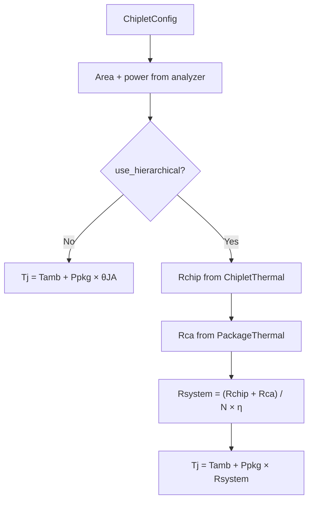

# Thermal Modeling

This document describes how junction temperature is estimated in **chiplet_thermal_analysis**: the thermal resistance network, the two analysis modes, configurable parameters, and how results are produced in code.

Related code: `chiplet_thermal/thermal_resistance.py`, `chiplet_thermal/analyzer.py`, `chiplet_thermal/constants.py`, `chiplet_thermal/models.py` (`ChipletConfig.chip_thermal`, `package_thermal`, `use_hierarchical`, `theta_ja`).

---

## 1. Purpose and scope

The tool estimates **package-level junction temperature** \(T_j\) for a multi-chiplet 3D stack (Logic + Basic die + stacked DRAM) under a given **total package power** \(P_{\mathrm{pkg}}\). Thermal modeling is **lumped (0-D)**: one effective resistance from junction to ambient per path, with optional layer-by-layer breakdown inside a single chiplet.

What the model does **not** do today:

- Per-chiplet temperature maps or hotspot spreading (`hotspot_area_ratio`, `use_spreading` exist on `ChipletThermal` but are not used in `compute_theta_jc_for_area`).
- Transient (time-dependent) thermal response.
- Separate memory vs logic die temperatures (a single uniform \(T_j\) is reported).

Power must be computed first (see `power.py` and `power_estimate.md`); thermal analysis consumes **total package power** from `compute_package_power`.

---

## 2. Analysis flow



Implementation: `ThermalPowerAnalyzer.analyze()` in `analyzer.py`.

---

## 3. Mode A — Simple lumped model (`use_hierarchical = False`)

A single junction-to-ambient resistance **`theta_ja`** (°C/W) is applied to the entire package:

\[
T_j = T_{\mathrm{amb}} + P_{\mathrm{pkg}} \cdot \theta_{JA}
\]

| Symbol | Config / constant | Default | Unit |
|--------|-------------------|---------|------|
| \(T_{\mathrm{amb}}\) | `ambient_temp` | 45 | °C |
| \(\theta_{JA}\) | `theta_ja` | `THETA_JA_SIMPLE` = 0.025 | °C/W |
| \(P_{\mathrm{pkg}}\) | from `compute_package_power` | — | W |

Use this mode for quick sweeps or when detailed stack geometry is not calibrated. It does **not** scale with chip area or chiplet count except indirectly through power.

---

## 4. Mode B — Hierarchical physical model (`use_hierarchical = True`)

The hierarchical model splits resistance into:

1. **Chiplet internal** \(R_{\mathrm{chip}}\) — junction to chip “case” surface (stack only; TIM on package side is handled separately).
2. **Package / cooling** \(R_{ca}\) — TIM, heatsink (finned convection), optional interposer.
3. **Multi-chiplet system** — parallel sharing of cooling path and coupling factor \(\eta\).

### 4.1 Chiplet internal stack (`ChipletThermal`)

Physical path (vertical, 1-D conduction through area \(A\)):

```
[ DRAM × N_layers ] — HB — [ Basic die ] — HB — [ Logic ]
```

Documented relation:

\[
R_{\mathrm{chip}} = R_{\mathrm{DRAM}} + R_{\mathrm{HB1}} + R_{\mathrm{Basic}} + R_{\mathrm{HB2}} + R_{\mathrm{Logic}}
\]

Implemented in `compute_theta_jc_for_area(area)` with \(A\) in **m²** (chiplet footprint):

| Component | Formula | Notes |
|-----------|---------|--------|
| \(R_{\mathrm{DRAM}}\) | \(\dfrac{N_{\mathrm{dram}} \cdot t_{\mathrm{dram}}}{k_{\mathrm{Si}} \cdot A}\) | Layer thicknesses summed |
| \(R_{\mathrm{HB}}\) (each interface) | \(\dfrac{\rho_{\mathrm{HB}}}{A}\) | `hb_thermal_density` = area-normalized resistance (m²·K/W) |
| \(R_{\mathrm{Basic}}\) | \(\dfrac{t_{\mathrm{basic}}}{k_{\mathrm{Si}} \cdot A}\) | |
| \(R_{\mathrm{Logic}}\) | \(\dfrac{t_{\mathrm{logic}}}{k_{\mathrm{Si}} \cdot A}\) | |

Total:

\[
R_{\mathrm{chip}} = \frac{N_{\mathrm{dram}} t_{\mathrm{dram}} + t_{\mathrm{basic}} + t_{\mathrm{logic}}}{k_{\mathrm{Si}} A} + \frac{2 \rho_{\mathrm{HB}}}{A}
\]

When `use_physical=False` on `ChipletThermal`, a fixed **`theta_jc`** is used instead (default 0.12 °C/W).

`compute_thermal_details(area)` returns a dict with `theta_jc_total`, `r_dram`, `r_hb`, `r_basic`, `r_logic` for reporting (only populated when hierarchical + physical chip thermal are enabled).

**Area coupling:** \(A = \texttt{chiplet\_final\_mm2} \times 10^{-6}\) m² from the area model. Larger footprint → lower \(R_{\mathrm{chip}}\).

Default stack parameters (from `constants.py` / `ChipletThermal`):

| Parameter | Field | Default |
|-----------|--------|---------|
| DRAM layers | `num_dram_layers` | 8 |
| DRAM layer thickness | `dram_thickness` | 50 µm |
| Basic die thickness | `basic_thickness` | 30 µm |
| Logic thickness | `logic_thickness` | 80 µm |
| Silicon conductivity | `k_si` | 120 W/(m·K) |
| HB thermal resistance density | `hb_thermal_density` | 1.0×10⁻⁶ m²·K/W (GUI: mm²·K/W × 10⁻⁶) |

### 4.2 Package / cooling path (`PackageThermal`)

\(R_{ca}\) is computed for **total active silicon area**:

\[
A_{\mathrm{total}} = A_{\mathrm{chiplet}} \times N_{\mathrm{chiplets}}
\]

When `use_physical=True`:

\[
R_{ca} = R_{\mathrm{TIM}} + R_{\mathrm{HS}} + R_{\mathrm{interposer}}
\]

| Term | Formula |
|------|---------|
| \(R_{\mathrm{TIM}}\) | \(t_{\mathrm{TIM}} / (k_{\mathrm{TIM}} \cdot A_{\mathrm{total}})\) |
| \(R_{\mathrm{HS}}\) | \(1 / (h \cdot A_{\mathrm{fins}} \cdot \eta_{\mathrm{fin}})\), with \(A_{\mathrm{fins}} = \texttt{fin\_area\_ratio} \cdot A_{\mathrm{total}}\) |
| \(R_{\mathrm{interposer}}\) | \(t_{\mathrm{ip}} / (k_{\mathrm{ip}} \cdot A_{\mathrm{total}})\) if `use_interposer` |

When `use_physical=False`, fixed **`theta_ca`** (default 0.015 °C/W) is used.

Defaults:

| Parameter | Default |
|-----------|---------|
| Convection \(h\) | 50 W/(m²·K) |
| Fin area ratio | 10 |
| Fin efficiency | 0.8 |
| TIM thickness / \(k\) | 100 µm / 3 W/(m·K) |
| Interposer (optional) | 200 µm, \(k\) = 0.4 W/(m·K), off by default |

### 4.3 Multi-chiplet system resistance and \(T_j\)

The analyzer combines chip and package resistances and applies a **thermal coupling factor** \(\eta\) (`thermal_coupling_factor`, default 1.15):

\[
R_{\mathrm{single}} = R_{\mathrm{chip}} + R_{ca}
\]

\[
R_{\mathrm{system}} = \frac{R_{\mathrm{single}}}{N_{\mathrm{chiplets}}} \cdot \eta
\]

\[
T_j = T_{\mathrm{amb}} + P_{\mathrm{pkg}} \cdot R_{\mathrm{system}}
\]

Interpretation (engineering approximation):

- Dividing by \(N\) models **parallel heat paths** sharing the same cooling assembly.
- \(\eta \geq 1\) inflates effective resistance for **non-ideal coupling** (lateral heat spreading between chiplets, bypass paths, TIM non-uniformity).

All chiplets are assigned the **same** \(T_j\) (uniform junction temperature).

---

## 5. Power input to the thermal model

Thermal modes use **package total power**:

\[
P_{\mathrm{pkg}} = N \cdot P_{\mathrm{chiplet}} \cdot (1 + \texttt{package\_loss\_ratio}) + P_{\mathrm{interposer,fixed}}
\]

See `compute_package_power` in `power.py`. Junction temperature is sensitive to \(P_{\mathrm{pkg}}\) and, in hierarchical mode, to area-driven \(R_{\mathrm{chip}}\) and \(R_{ca}\).

---

## 6. Configuration surfaces

| Source | How thermal params are set |
|--------|----------------------------|
| `constants.py` | Defaults for `ChipletThermal` / `PackageThermal` and `theta_ja` |
| `ChipletConfig` | `use_hierarchical`, `ambient_temp`, `theta_ja`, nested `chip_thermal`, `package_thermal` |
| `analyze_scaling` / GUI | DRAM thicknesses, \(k_{\mathrm{Si}}\), HB density, fin model, \(\eta\), flags `use_physical_package`, `use_interposer_thermal` |
| JSON example | `examples/chiplet_thermal_params.example.json` (`hb_thermal_mm2kw`, `use_hierarchical`, etc.) |

GUI field **`HB界面热阻密度 [mm²·K/W]`** maps to `hb_thermal_res_density` in SI (× 10⁻⁶) → `ChipletThermal.hb_thermal_density`.

---

## 7. Outputs

| Output | Location |
|--------|----------|
| `junction_temp` | `PowerThermalResult` (scalar in both modes today) |
| `thermal_details` | Optional dict from `compute_thermal_details` when hierarchical + physical chip thermal |
| Tables | `analyze_scaling` DataFrame column `结温(°C)` |

Optional human-readable dump: `ThermalPowerAnalyzer.print_result(result)`.

---

## 8. Model limitations and extensions

| Topic | Current behavior | Possible extension |
|-------|------------------|-------------------|
| Hotspots | Parameters unused | Add spreading resistance \(\propto 1/\sqrt{A_{\mathrm{hotspot}}}\) |
| DRAM vs logic \(T\) | Single \(T_j\) | Separate networks or weighting by layer power |
| TIM placement | TIM in package path only | Duplicate or relocate TIM in chip vs package split |
| Chiplet imbalance | Uniform \(T_j\) | Per-chiplet \(R\) or power-weighted list |
| Calibration | Literature defaults | Fit \(\theta_{JA}\), \(\rho_{\mathrm{HB}}\), \(h\) to measured \(T_j\) |

Constants `R_CU_INTERFACE_DENSITY`, `R_DIELECTRIC_DENSITY`, `CU_COVERAGE`, and `HYBRID_BOND_MODEL` in `constants.py` are reserved for a finer hybrid-bond model; the running code uses the single **`hb_thermal_density`** term.

---

## 9. Quick reference — key equations (code-aligned)

**Simple:**

\[
T_j = T_{\mathrm{amb}} + P_{\mathrm{pkg}} \theta_{JA}
\]

**Hierarchical:**

\[
R_{\mathrm{chip}}(A) = \frac{N_{\mathrm{dram}} t_{\mathrm{dram}} + t_{\mathrm{basic}} + t_{\mathrm{logic}}}{k_{\mathrm{Si}} A} + \frac{2\rho_{\mathrm{HB}}}{A}
\]

\[
R_{ca}(A_{\mathrm{total}}) = \frac{t_{\mathrm{TIM}}}{k_{\mathrm{TIM}} A_{\mathrm{total}}} + \frac{1}{h \cdot \beta_{\mathrm{fin}} A_{\mathrm{total}} \eta_{\mathrm{fin}}} + R_{\mathrm{ip,optional}}
\]

\[
T_j = T_{\mathrm{amb}} + P_{\mathrm{pkg}} \cdot \frac{R_{\mathrm{chip}}(A) + R_{ca}(N A)}{N} \cdot \eta
\]

where \(A\) is single-chiplet area (m²), \(\beta_{\mathrm{fin}}\) = `fin_area_ratio`, \(\eta_{\mathrm{fin}}\) = `fin_efficiency`, \(\eta\) = `thermal_coupling_factor`.

---

## 中文完整版（完整翻译）

以下为 Thermal Modeling 文档的中文完整翻译，保留章节和公式，便于中文读者全面理解模型实现与参数。

# 热建模（中文版）

本文档描述 chiplet_thermal_analysis 中如何估算结温（junction temperature）$T_j$：热阻网络、两种分析模式、可配置参数，以及代码中如何产生结果。

相关代码：`chiplet_thermal/thermal_resistance.py`、`chiplet_thermal/analyzer.py`、`chiplet_thermal/constants.py`、`chiplet_thermal/models.py`（`ChipletConfig.chip_thermal`、`package_thermal`、`use_hierarchical`、`theta_ja`）。

---

## 1. 目的与范围

工具估算多 chiplet 3D 堆栈（Logic + Basic die + 堆叠 DRAM）的封装级结温 $T_j$，以给定的总封装功耗 $P_{pkg}$ 为输入。热模型为简化（0-D）模型：每条散热路径上存在一个从结点到环境的等效热阻，可选在单个 chiplet 内进行分层细化。

不包含的内容：

- 每芯片的温度分布或热点扩散（参数如 `hotspot_area_ratio`, `use_spreading` 在 `ChipletThermal` 中存在但 `compute_theta_jc_for_area` 未使用）
- 瞬态热响应
- 将存储与逻辑的温度区分（当前仅报告单一 $T_j$）

功耗需先计算（见 `power.py` 和 `power_estimate.md`）；热分析使用 `compute_package_power` 的封装总功耗作为输入。

---

## 2. 分析流程

（同英文版流程图与说明）

---

## 3. 模式 A — 简单 Lumped 模型（`use_hierarchical = False`）

对整个封装使用一个单一的结对环境热阻 `theta_ja`（°C/W）：

\[
T_j = T_{amb} + P_{pkg} \cdot \theta_{JA}
\]

配置表见英文版。

---

## 4. 模式 B — 分层物理模型（`use_hierarchical = True`）

分为：

1. 芯片内部 $R_{chip}$ — 从结到芯片“封装面”的热阻（堆栈内，封装侧 TIM 单独处理）。
2. 封装/散热 $R_{ca}$ — TIM、散热器（翅片对流）、可选中介层（interposer）。
3. 多 chiplet 系统 — 并联分担冷却路径以及耦合因子 $\eta$。

### 4.1 芯片内部堆栈（`ChipletThermal`）

垂直 1-D 传导路径，沿面积 $A$：

\[
R_{chip} = R_{DRAM} + R_{HB1} + R_{Basic} + R_{HB2} + R_{Logic}
\]

代码实现（`compute_theta_jc_for_area(area)`）以 $A$（m²）为输入。组件近似为：

\[
R_{chip} = \frac{N_{dram} t_{dram} + t_{basic} + t_{logic}}{k_{Si} A} + \frac{2 \rho_{HB}}{A}
\]

当 `use_physical=False` 时使用固定 `theta_jc`。

### 4.2 封装 / 散热路径（`PackageThermal`）

总活性硅面积：

\[
A_{total} = A_{chiplet} \times N_{chiplets}
\]

若 `use_physical=True`：

\[
R_{ca} = R_{TIM} + R_{HS} + R_{interposer}
\]

各项按面积缩放（见英文公式）。

### 4.3 系统级合并与 $T_j$：

\[
R_{single} = R_{chip} + R_{ca}
\]

\[
R_{system} = \frac{R_{single}}{N_{chiplets}} \cdot \eta
\]

\[
T_j = T_{amb} + P_{pkg} \cdot R_{system}
\]

注：除以 $N$ 模拟并联热路径；$\eta\ge1$ 考虑非理想耦合。

---

## 5. 热模型的功耗输入

热模型使用封装总功耗：

\[
P_{pkg} = N \cdot P_{chiplet} \cdot (1 + \texttt{package\_loss\_ratio}) + P_{interposer,fixed}
\]

---

## 6. 配置界面与参数来源

（参见英文版表格，中文补充了单位转换和 GUI 字段映射说明）

---

## 7. 输出与报告

`junction_temp`（标量），以及在分层+物理模式下 `thermal_details` 字典（包含 `theta_jc_total`、各段热阻）等。

---

## 8. 模型局限与扩展（中文说明）

列出热点、DRAM vs logic 温差、TIM 放置、芯片不平衡、标定等项的当前行为与可选扩展。

---

## 9. 关键方程速查（中英对照）

简单模型与分层模型关键等式在文中给出（中文版保留与英文一致的公式符号与单位）。

